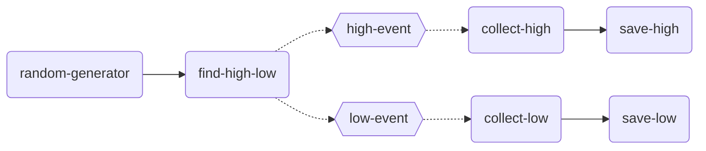

Tutorial coming soon.

```mermaid
graph LR;
    Random(random-generator)-->FindHighLowValues(find-high-low);
    FindHighLowValues(find-high-low)-.->HighEvent{{high-event}};
    FindHighLowValues(find-high-low)-.->LowEvent{{low-event}};
    HighEvent{{high-event}}-.->CollectHigh(collect-high);
    LowEvent{{low-event}}-.->CollectLow(collect-low);
    CollectHigh(collect-high)-->SaveHigh(save-high);
    CollectLow(collect-low)-->SaveLow(save-low);
```